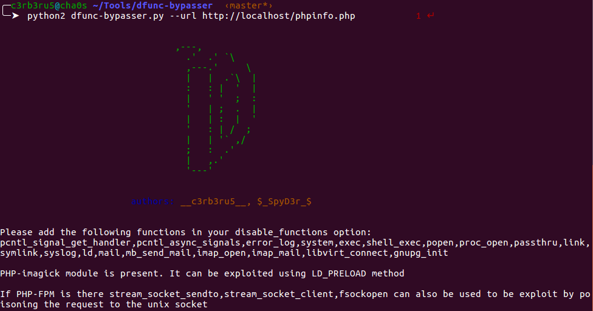
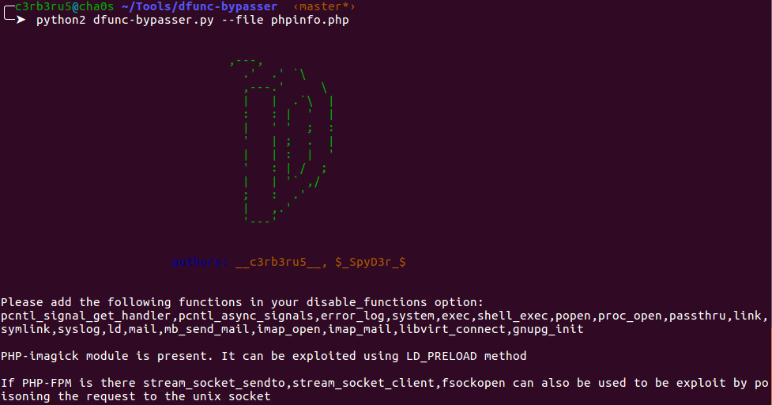
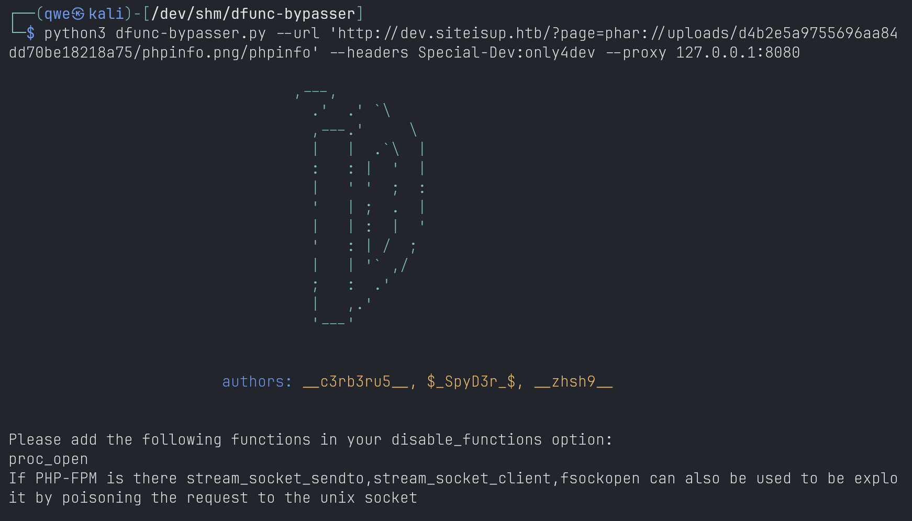
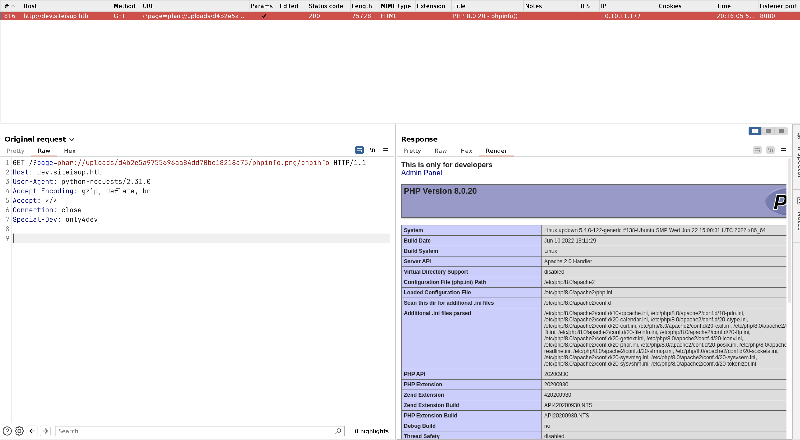

# Dfunc-Bypasser
This is a tool that can be used by developers to check if exploitation using LD_PRELOAD is still possible given the current disable_functions in the php.ini file and taking into consideration the PHP modules installed on the server.

## Installation
`git clone https://github.com/teambi0s/dfunc-bypasser`

## Usage
There are two options to input the disable_functions list:
1. For help on the parameters:
`python dfunc-bypasser.py -h`
2. Provide the phpinfo url:
`python dfunc-bypasser.py --url https://example.com/phpinfo.php`
3. Provide the local phpinfo file:
`python dfunc-bypasser.py --file dir/phpinfo`
4. Provide the customized headers: `python dfunc-bypasser.py --url https://example.com/phpinfo.php --headers A:B`
5. Provide the proxy: `python dfunc-bypasser.py --url https://example.com/phpinfo.php --proxy 127.0.0.1:8080`

## Contributers
1. S Ashwin Shenoi
    * Github: [ashwinshenoi99](https://github.com/ashwinshenoi99)
    * Twitter: [c3rb3ru5](https://twitter.com/__c3rb3ru5__)
2. Tarunkant Gupta
    * Github: [tarunkant](https://github.com/tarunkant/)
    * Twitter: [TarunkantG](https://twitter.com/TarunkantG)

from team [bi0s](https://bi0s.in)

3. zhsh9
    * Github: [zhsh9](https://github.com/zhsh9)
    * HackTheBox: [
3C11P53](https://app.hackthebox.com/profile/1736556)

from team [NoobCat](https://app.hackthebox.com/public/teams/overview/5973)

## Screenshots

Use dfunc-bypasser with headers and proxy options:

